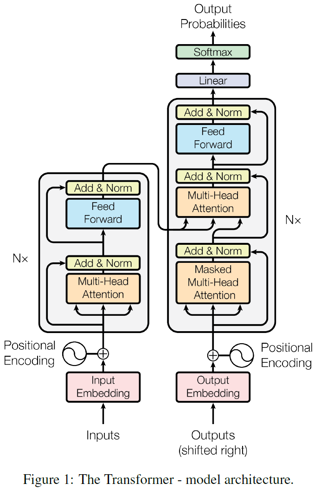

<cite>[[Ashish Vaswani]], [[Noam Shazeer]], [[Niki Parmar]], [[Jakob Uszkoreit]], [[Llion Jones]], [[Aidan N.Gomez]], [[Lukasz Kaiser]]</cite>

# Introduction

序列转导模型的编码器和解码器主要基于复杂的递归或卷积神经网络，其中表现最好的模型在编码器和解码器之间通过一个注意力机制层相连。我们提出一种简单的模型架构：Transformer。仅仅基于注意力机制，完全去除递归和卷积。同时Transformer可以很好地推广到其他任务中。

# Background

对于递归模型，其通常沿着输入和输出序列的符号位置进行因数计算，将位置与计算时间中的步骤对其， $t$ 时刻的隐藏状态 $h_t$ 作为下一时刻 $t+1$ 计算的输入。这种固有的顺序限制了训练时的并行化。本文提出的Transformer完全依靠注意力机制来计算输入和输出之间的全局关系。

对于使用卷积神经网络减少顺序计算的模型，将来自不同位置的输入或输出信号关联起来所需的计算操作随着信号之间的距离的增加而增加。这使得学习远距离位置信息之间的依赖关系变得困难。在Transformer中，这种操作的数量被控制为一个恒定的常数（尽管由于平均注意力加权位置而降低了有效分辨率，Transformer使用Multi-Head Attention来解决）。

Self-attention，有时称为intra-attention。是一种注意力机制，将单个序列的不同位置联系起来，以计算序列的表示。

# Model Architecture

Transformer基于encoder-decoder 架构。其中，encoder将由符号表征的输入序列 $(x_1, ..., x_n)$ 映射为连续的序列表征 $\mathbf{z} = (z_1, ..., z_n)$。对于给定的 $\mathbf{z}$ ，decoder利用其生成一个输出的符号序列 $(y_1, ..., y_n)$ 。在encoder和decoder中，使用堆栈式自注意力和逐点的全连接层。

## Encoder 和 Decoder

**Encoder** : Encoder 由 $N = 6$ 个相同的层组成，每个层都有两个子层。第一个子层是多头自注意力机制(multi-head self-attention mechanism)，第二个子层是一个逐位置的全连接前馈网络(position-wise fully connected feed-forward network)

每个子层之后都有一个 [[LayerNormalization|Layer Normalization]] 层，并通过残差连接相连。即，每个子层的输出是： $\text{LayerNorm}(x + \text{Sublayer}(x))$，其中的 $\text{Sublayer}(x)$ 表示子层所实现的操作。为了应用残差连接，模型中的所有子层，包括嵌入层，输出维度都是 $d_{model} = 512$

**Decoder** : Decoder 也是由 $N = 6$ 个相同的层组成，每个层中除了与encoder相同的两个子层外，decoder还插入了第三个子层，用于对encoder stack的输出进行multi-head attention。

与encoder类似，decoder中也使用了残差连接的layer normalization层。decoder中修改了stack中的自注意力层(Masked Multi-head Attention)，防止对某位置的解码过程中涉及后续位置的信息。这种遮蔽式的修改，配合输出的embedding偏移一个位置的设置，确保了对 $i$ 位置的预测只依赖小于 $i$ 位置处的已知输出。

## Attention

注意力函数 (attention function) 就是将一个 query 和一系列 key-value 对映射到一个输出(output)的过程，其中的 query, key, value和output都是向量。output由values的加权和计算，其中分配给每个value的权重由querry和相应的key经过一个函数计算。

这里提到的 querries，keys和values是由输入 $X$ 计算得到的

### Scaled Dot-Product Attention

我们使用的Attention称为 Scaled Dot-Product Attention。它的输入包括维度为 $d_k$ 的queries和keys，以及维度为 $d_v$ 的values。我们计算每个 querry 与所有 keys 的点乘，并除以 $\sqrt{d_k}$ ，然后经过一个 [[Softmax|Softmax]] 获取所有 values 的权重。

实践中，我们通过将querries打包进同一个矩阵 $Q$ 来并行化attention function的计算。keys和values也被分别打包为矩阵 $K$ 和 $V$，计算过程为： $\text{Attention}(Q, K, V) = \text{softmax}(\frac{QK^T}{\sqrt{d_k}})V$

我们的attention function除了乘以一个缩放因子 $\frac{1}{\sqrt{d_k}}$ 之外与 dot-product attention相同。缩放的原因是：[我们怀疑]对于较大的维度值 $d_k$ ，点积运算结果的增长幅度较大，会将 [[Softmax|Softmax]] 函数的梯度推向非常小的区域。

### Multi-Head Attention

与在一个单独的attention function上对 $d_{model}$ 维度的 querries, keys 和 values进行计算相比，将 querries，keys 和 values 以不同的，可学习的线性投影分别投射到 $h$ 个通道上并行进行 attention function更有好处，在每个通道上，querries, keys和values分别为 $d_k, d_k和d_v$维度。在 $h$ 个通道上并行进行的attention function最终得到 $h$ 个输出矩阵，将其连接起来再经过一个投影矩阵，得到最终的结果。这种机制允许模型同时关注来自不同位置的不同表征子空间的信息。在只有一个attention head时，加权平均抑制了这种特性。

Multi-Head Attention的数学过程为： $\text{MultiHead}(Q, K, V) = \text{Concat}(head_1, ..., head_h)W^O$, 其中 $head_i = \text{Attention}(QW_i^Q, KW_i^K, VW_i^V)$

其中的 $W_i^Q \in \mathbb{R}^{d_{model}\times d_k}, W_i^K \in \mathbb{R}^{d_{model}\times d_k}, W_i^V \in \mathbb{R}^{d_{model} \times d_v}$即是分别用在 $Q, K, V$ 上的投影矩阵， $W^O\in \mathbb{R}^{hd_v\times d_{model}}$是用作连接后的结果矩阵的投影矩阵。

在本文的工作中，我们使用了 $h = 8$ 个并行attention层(heads)，对于每一个并行层，使用 $d_k = d_v = d_{model}/h = 64$

### Applications of Attention in our Model

- 在encoder-decoder attention层（decoder的第二个multi-attention层），querries来自上一层decoder的输出，keys和values则由encoder的输出计算得到。这种机制使decoder在每一个位置上都可以注意到输入所有位置上的信息。
- 在encoder的self-attention层中，所有的querries，keys和values都来自上一层encoder的输出，encoder的每一个位置都可以注意上一层encoder输出的所有位置
- decoder中的self-attention层（第一个Multi-attention层）允许每个位置注意到这个位置之前包括这个位置的信息，但是禁止左侧位置参考右侧的信息，以保持模型的自回归特性。我们通过将 [[Softmax|Softmax]] 的输入中所有非法连接的值设置为 $-\inf$ 来实现这一点。

## 逐位置前馈网络(Position-wise Feed-Forward Networks)

在encoder和decoder的每一层中，都包含一个全连接的前馈网络层，对所有位置分别进行相同的操作。由两个全连接层组成，第一个全连接层的激活函数是 [[ReLU|ReLU]]  ，第二个不需要激活函数：$\text{FFN}(x) = max(0, xW_1+b_1)W_2 + b_2$

每一层不同位置上的线性变换相同，但不同层上的参数不同。另一种描述这种过程的方式是使用两个size为1的卷积核进行两次卷积，其中输入和输出维度为 $d_{model}=512$，内层维度为 $d_{ff} = 2048$

## 位置编码(Positional Encoding)

Transformer模型中没有使用递归和卷积，因此必须在输入中插入关于token在序列中位置的信息，从而使模型能够利用序列的顺序信息。我们将与embedding相同维度的positional encoding与embedding相加作为encoder和decoder的输入。本文使用的是cos函数的调频编码：

$\begin{cases}PE_{(pos, 2i)} &= \sin(pos/10000^{2i/d_{model}}) \\PE_{(pos, 2i+1)} &= \cos(pos/10000^{2i/d_{model}})\end{cases}$

其中， $pos$ 是token的位置， $i$ 是维度。即，每个维度的位置编码对应着一个正弦波，不同维度的正弦波的波长形成 $2\pi - 10000\cdot 2\pi$范围的几何级数。我们选择这种编码是因为对于任意的offset $k$， $PE_{pos+K}$可以表示为 $PE_{pos}$的线性变换，因此我们假设这种编码方法可以使模型轻易学习到注意相对位置特征。

# Why Self-Attention

self-attention层与递归和卷积层相比在序列转导模型中的优势：

1. 每层的总计算复杂度
2. 可以被并行化的计算量，由必要的最小顺序化操作数量衡量
3. 在网络中计算long-range依赖需要的计算路径长度。即为了学习long-range依赖，信号在网络中必须要经过的路径长度，这个长度越短，模型就越容易学习long-range依赖。

# 训练

## 优化器

Adam optimizer，参数设置为： $\beta_1 = 0.9, \beta_2 = 0.98, \epsilon = 10^{-9}$。学习率在训练过程中按照以下公式变化： $lrate = d_{model}^{-0.5}\cdot \text{min}(step\_num^{-0.5}, step\_num\cdot warmup\_steps^{-1.5})$

其中 $warmup\_steps = 4000$

## 正则化

**Residual Dropout** 1. 在每个子层的输出位置，残差连接之前。2. 在encoder及decoder的embedding和positional encoding相加的位置。参数为 $p_{drop} = 0.1$

**Label Smoothing** 训练时使用了 $\epsilon_{ls} = 0.1$的标签平滑