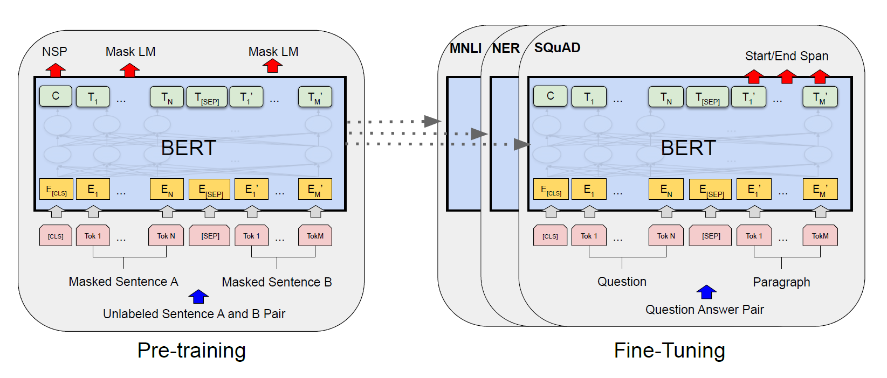
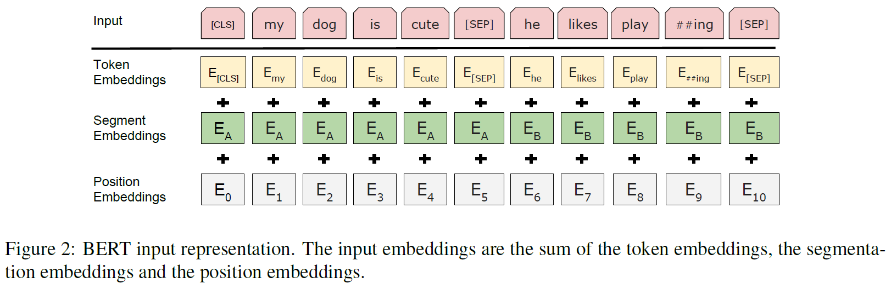

<cite>[[Jacob Devlin]], [[Ming-Wei Chang]], [[Kenton Lee]], [[Kristina Toutanova]]</cite>

# Introduction

**BERT** 是一种新的语言表征模型，它是一种双向编码器表征的 [[Attention-is-all-you-need|Transformer]] 模型(**B**idirectional **E**ncoder **R**epresentions from **T**ransformers)

BERT 利用了无标签预训练文本数据的左右上下文信息，训练出一个深度双向表征模型。预训练后的模型可以通过一个**额外的输出层**并微调到多个下游任务，并取得 state-of-the-art 的结果。

本文中，BERT通过使用“掩码语言模型(Masked Language Model, MLM)”作为预训练目标函数，缓解了单向性约束，改进了基于微调的方法。MLM即随机地将输入中的一些token替换为掩码，并且目标是基于上下文预测被掩码位置token的原始词典id。这种目标函数使表征有能力融合左右上下文的信息，从而使训练一个深度双向Transformer成为可能。

BERT是第一个在大量句级和词级任务上取得最优结果的基于微调的表征模型，优于许多特定于任务的体系结构。

# Background

语言模型预训练在提升NLP任务上十分有效。在把预训练模型应用在下游任务上，目前有两种策略： *feature-based* 和 *fine-tuning* 。基于特征的方法，如 **ELMo** ，使用特定于任务的架构作为额外的特征，其中包括预训练表征。基于微调的方法，如 **GPT** 引入了最小特定于任务的参数，并且在下游任务上通过微调所有的预训练参数来进行训练。这两类方法在预训练时使用同样的目标函数：利用单向语言模型来学习通用语言表征。

我们认为现有的技术限制了预训练表征的能力，特别是对于微调的方法。主要表现在单向的标准语言模型限制了预训练时模型的架构选择。**这样的限制对于句级(sentence-level)的任务通常是次优的，对于词级(token-level)的任务通常十分有害。**

无监督的微调方法中，用于生成下文token表征的文档或句子编码器从无标签的文本中预训练，并针对有监督的下游任务进行微调。这样做的优势在于只有很少的参数需要从零开始学习。在这种模型的预训练过程中，通常使用自左向右的语言建模和自动编码器目标函数。

# BERT

BERT提出的框架分为两步：预训练和微调。在预训练中，模型通过不同的预训练任务在无标签的数据集上进行训练。在微调时，模型首先使用预训练得到的参数进行初始化，然后所有的参数都使用有标签的下游任务数据进行微调。每一种下游任务都使用相同的预训练模型进行初始化，然后分别微调。

## 模型架构

BERT的模型架构是一个多层双向Transformer编码器。

假设层数(即Transformer blocks)为 $L$ ，隐藏层尺寸为 $H$，self-attention heads数量为 $A$。初步设计了两种尺寸的模型： $\text{BERT}_\text{BASE}(\text{L=12, H=768, A=12, Total Parameters=110M})$和 $\text{BERT}_\text{LARGE}(\text{L=24, H=1024, A=16, Total Parameters=340M})$

## 输入输出表征

针对不同的下游任务需要，BERT可以清晰地将一个单独的句子或一个句子对表示为一个序列。其中，句子可以指一段文本中的任务跨度，而不仅仅是实际的语言句子。一个序列指输入到BERT的token序列，可以是一个单独的句子或两个句子打包在一起。

每一个序列中的第一个token总是一个特殊的分类token：[CLS]，对应的最终隐藏状态用于分类任务中作为序列的总体类型表示。对于打包在一起的句子对，使用两种方法对其进行区分：1. 可以使用一个特殊的token [SEP]作为分段标志。2. 为每个token添加一个可学习的embedding来指示这个token属于句子A或句子B

假设输入embedding是 $E$，特殊token [CLS]的最终隐藏向量是 $C\in \mathbb{R}^H$，第 $i$ 个输入token的最终隐藏向量为 $T_i\in \mathbb{R}^H$

对于一个输入token，它的表征由对应的token embedding, 分段embedding和位置embedding的加和构成。

## 预训练

BERT的预训练使用两种无监督任务：

**Masked LM** : 直觉上来说，深度双向模型比单向模型或者两个单向模型连接的效果更好。但是，标准的条件语言模型只能是单向的。这是因为标准语言模型是以预测当前词为目标，而双向模型将允许每个词“看到自己”，这样模型就可以在多层上下文中直接给出目标词。

为了训练双向表征，BERT使用MLM：

在输入序列中随机抽取 tokens, 然后将抽取到的 tokens 替换为特殊的掩码 token: [MASK]

掩码token最终的隐藏向量被投影到词典维度，然后经过 [[Softmax|Softmax]] 函数，代表该 token 在词典上的概率分布。MLM 的训练损失是该概率分布的交叉熵损失。

**这种训练目标带来一个问题：在预训练和微调之间形成了割裂——在微调中不存在所谓的掩码**。针对这个问题，我们并不是总是将掩码位置的token替换为[MASK]，而是以下述规则进行掩码操作：

对于输入序列中被选中的 tokens(15%)：
- 其中的 80% 被替换为 [MASK]
- 其中的 10% 保持不变
- 另外的 10% 被替换为词典中的随机词

然后， $T_i$ 被用于使用交叉熵预测原始的token

**Next Sentence Prediction, NSP** (副训练目标)：

NSP 的训练目标是两个句子在原始语料库中是否连续的二元分类损失，在样本构造方面，正样本从同一文档中采样，负样本从不同文档中分别采样上句和下句，正负样本等概率采样

具体地说，选择两个句子A，B作为一个预训练样本。50%的时间B是A的下一句(标记为 $\text{IsNext}$)，另外50%的时间不是(标记为 $\text{NotNext}$)。上文所述的对应于特殊token [CLS]的最终隐藏向量用于NSP任务，其值经过 [[Softmax|Softmax]] 得到NSP的预测概率。

## 微调

微调的过程即在预训练后的BERT模型上添加一个简单的分类层，然后在下游任务数据上调整所有的参数。

对于每个下游任务， 只需要简单地插入特定于任务的输入输出数据并端到端微调所有的参数。

# Evaluation

