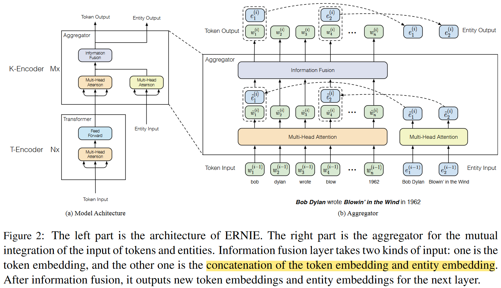
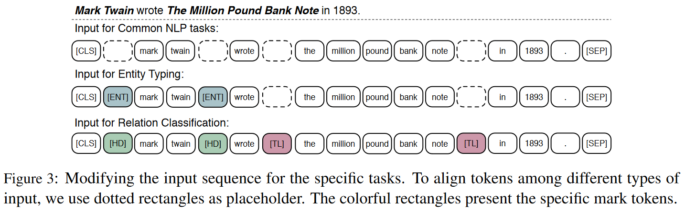

# ERNIE: Enhanced Language Representation with Informative Entities
<cite>[[Zhengyan Zhang]], [[Xu Han]], [[Zhiyuan Liu]], [[Xin Jiang]], [[Maosong Sun]], [[Qun Liu]]</cite>

## Motivition

[[BERT-Pre-training-of-Deep-Bidirectional-Transformers-for-Language-Understanding|BERT]] 等在大规模语料库上训练的语言表征模型可以提取到丰富的语义信息，作者认为结合知识图谱中的实体信息可以引入额外知识来增强语言表征。

BERT 等语言表征模型虽然已经作为许多 NLP 任务的一部分取得了很好的结果，但是由于没有引入先验知识，在语言理解类任务中存在劣势。例如对于自然语言语句：$\text{Bob Dylan wrote Blowin’ in the Wind in 1962, and wrote Chronicles: Volume One in 2004.}$, 如果不知道 $\text{Blowin’ in the Wind}$ 和 $\text{Chronicles: Volume One}$ 是歌曲，在实体分类任务中就无法分辨 $\text{Bob Dylan}$ 究竟是作家还是歌手。同时也几乎无法提取细粒度关系。因此，引入引入额外的知识信息可以在许多基于知识的任务中受益，例如实体分类和关系识别任务。

## Challenge

为了在语言表征中引入额外知识，有以下两个挑战：
1. 结构化知识编码：即如何从知识图谱中提取和编码与输入文本有关的知识信息
2. 异构信息融合：即如何设计一种特殊的预训练目标，以融合语义，句法和知识信息

## Contribution

1. 针对结构化知识编码问题：作者首先识别出输入文本中提及的实体，然后将其与其在知识图谱中相应的实体对齐(提取)。在编码方面，作者使用知识嵌入算法（如 TransE）对知识图谱的图结构进行编码，并将编码的知识嵌入作为 ERNIE 的输入。基于文本和知识实体之间的对齐， ERINE 将知识模块中的实体表征集成到了语义模块的底层
2. 与 BERT 类似，作者使用了 MLM 和 NSP 作为预训练目标。除此之外，作者设计了一种新的预训练目标以更好地融合文本和知识特征：随机遮住输入文本中的一些命名实体对齐，并让模型从知识图谱中选择合适的实体来补全遮住的部分。这使得模型必须结合上下文信息和知识信息才能预测被遮住的 tokens 和 entities，从而实现了一个知识性的语言表征模型

## Methodology

输入序列记作 $\{w_1, ..., w_n\}$, 其中 $n$ 是序列的 token 长度。输入序列中的实体序列记作 $\{e_1, ..., e_m\}$, 其中 $m$ 是实体序列的长度。将包含所有 token 的词典记作 $\mathcal{V}$, 包括知识图谱中所有实体的实体列表记作 $\mathcal{E}$。如果一个 token $w \in \mathcal{V}$ 属于一个实体 $e \in \mathcal{E}$, 则定义它们的对齐为：$f(w) = e$。本文中，将所有的实体对齐到实体短语的第一个 token。

### 模型架构

ERNIE 的架构包含两个模块：
1. 基础的文本编码器 ($\text{T-Encoder}$), 负责捕捉基础的语义和语法信息。（BERT）
2. 上层的知识编码器 ($\text{K-Encoder}$), 负责将额外的 token 导向的知识信息融合到文本信息的底层。

$\text{T-Encoder}, \text{K-Encoder}$ 的层数分别为 $N, M$

如图中所示，对于一个给定的 token 序列 $\{w_1, ..., w_n\}$ 和对应的实体序列 $\{e_1, ..., e_m\}$, 文本编码器首先将对每个 token 计算输入 embedding：token embedding + segment embedding + positional embedding. 然后计算语法语义特征(BERT 的过程)：

$$\{\mathbf{w}_1, ..., \mathbf{w}_n\} = \text{T-Encoder}(\{w_1, ..., w_n\})$$

其中的 $\text{T-Encoder}(\cdot)$ 是一个多层双向 Transformer 编码器，与 BERT 相同。

之后，ERNIE 使用一个知识编码器 $\text{K-Encoder}$ 来向语言表征插入知识信息。具体地说，首先使用预训练的知识嵌入模型 [[Translating-Embeddings-for-Modeling-Multi-relational-Data|TransE]] 计算实体序列 $\{e_1, ..., e_m\}$ 的嵌入 $\{\mathbf{e}_1, ..., \mathbf{e}_m\}$, 然后将 $\{\mathbf{w}_1, ..., \mathbf{w}_n\}$ 和 $\{\mathbf{e}_1, ..., \mathbf{e}_m\}$ 送入 $\text{K-Encoder}$ 进行异构信息融合并计算最终的输出嵌入：

$$\{\mathbf{w}_1^o, ..., \mathbf{w}_n^o\}, \{\mathbf{e}_1^o, ..., \mathbf{e}_m^o\} = \text{K-Encoder}(\{\mathbf{w}_1, ..., \mathbf{w}_n\}, \{\mathbf{e}_1, ..., \mathbf{e}_m\})$$

$\{\mathbf{w}_1^o, ..., \mathbf{w}_n^o\}, \{\mathbf{e}_1^o, ..., \mathbf{e}_m^o\}$ 将被用于具体的任务。

### 知识编码器

$\text{K-Encoder}$ 中的 $\text{Multi-Head Attention}$ 部分即正常的自注意力过程:

$$\begin{array}{rl}
    \{\widetilde{\mathbf{w}}_1^{(i)}, ..., \widetilde{\mathbf{w}}_n^{(i)}\} &= \text{MH-ATT}(\{\mathbf{w}_1^{(i-1)}, ..., \mathbf{w}_n^{(i-1)}\})\\
    \{\widetilde{\mathbf{e}}_1^{(i)}, ..., \widetilde{\mathbf{e}}_m^{(i)}\} &= \text{MH-ATT}(\{\mathbf{e}_1^{(i-1)}, ..., \mathbf{e}_m^{(i-1)}\})
\end{array}$$

经过自注意之后，第 $i$ 个聚合器用于将 token 和 entity 序列相互融合，并为每个 token 和 entity 计算一个输出 embedding。对于 token $w_j$ 和它对应的实体 $e_k = f(w_j)$, 信息融合过程如下：

$$\begin{array}{rl}
    \mathbf{h}_j &= \sigma(\widetilde{\mathbf{W}}_t^{(i)}\widetilde{\mathbf{w}}_j^{(i)} + \widetilde{\mathbf{W}}_e^{i}\widetilde{\mathbf{e}}_k^{(i)} + \widetilde{\mathbf{b}}^{(i)})\\
    \mathbf{w}_j^{(i)} &= \sigma(\mathbf{W}_t^{(i)}\mathbf{h}_j + \mathbf{b}_t^{(i)})\\
    \mathbf{e}_k^{(i)} &= \sigma(\widetilde{\mathbf{W}}_e^{(i)}\mathbf{h}_j + \mathbf{b}_e^{(i)})
\end{array}$$

其中的 $\mathbf{h}_j$ 是聚合了 token 和 entity 信息的内部隐藏状态。$\sigma(\cdot)$ 是非线性激活函数，通常是 GELU 函数。对于不属于实体短语的 tokens, 信息融合层计算其输出 embedding 的过程如下：

$$\begin{array}{rl}
    \mathbf{h}_j &= \sigma(\widetilde{\mathbf{W}}_t^{(i)}\widetilde{\mathbf{w}}_j^{(i)} + \widetilde{\mathbf{b}}^{(i)})\\
    \mathbf{w}_j^{(i)} &= \sigma(\mathbf{W}_t^{(i)}\mathbf{h}_j + \mathbf{b}_t^{(i)})
\end{array}$$

顶部的聚合器输出的 token 和 entity 嵌入被用作 $\text{K-Encoder}$ 的最终输出嵌入

### 预训练

**去噪实体自动编码器(denoision entity auto-encoder, dEA)**：随机遮住一些 token-entity alignments, 并要求系统预测所有对应的实体。

考虑到实体列表 $\mathcal{E}$ 可能很大，仅要求系统从给定的实体列表的子集中预测实体。

给定 token 序列 $\{w_1, ..., w_n\}$ 和对应的实体序列 $\{e_1, ..., e_m\}$, 定义 token $w_i$ 的实体分布为：

$$p(e_j|w_i) = \frac{\exp(\text{linear}(\mathbf{w}_i^o)\cdot \mathbf{e}_j)}{\Sigma_{k = 1}^{m}\exp(\text{linear}(\mathbf{w}_i^o)\cdot \mathbf{e}_k)}$$

其中的 $\text{linear}(\cdot)$ 是一个线性层，上式被用来计算 dEA 目标的交叉熵损失函数。

### 微调

与 BERT 类似，ERNIE 输入序列的第一个 token 也是特殊的 token $\text{[CLS]}$，用于特殊的任务。

对于关系分类任务，系统需要根据上下文来为给定的实体对分类。本文提出的方法是，修改输入序列，在序列中的实体两端添加特殊的 mark token ，这些 mark token 在关系分类模型中起到类似位置嵌入的作用。如下图所示，分别使用 $\text{[HD]}$ 和 $\text{[TL]}$ 来标记头部的实体和尾部的实体。

对于实体分类任务，其微调过程是关系分类任务的简化版本。早前的模型同时利用了上下文嵌入(context embedding) 和实体提及嵌入(entity mention embedding)，作者认为修改输入序列在实体提及的两端加上特殊的 token $\text{[ENT]}$ 可以引导 ERNIE 结合上下文信息和实体提及信息。

## 实验

### 预训练

预训练时的 token 编码器(T-Encoder)直接应用 BERT 的参数。预训练的过程是一个多任务(MLM, NSP, dEA)的过程，作者使用英文维基作为语料库。总共约有 4500M 个子词和 140M 个实体。

预训练之前，先利用由维基数据训练的知识嵌入 TransE 作为实体的输入嵌入。具体地说，作者采样了维基数据中的 5040986 个实体和 24267796 个三元组。实体的知识嵌入在训练过程中固定，实体编码模块参数随机初始化。

### 实体分类

分别在 FIGER 和 Open Entity 数据集上与 NFGEC, UEFT 和 BERT 作比较。证明了

1. 预训练语言模型比传统的实体分类模型更具表征能力，能够充分利用训练数据中的信息。
2. 与 BERT 相比，ERNIE 由于引入了额外知识提高了分类精度。

### 关系分类

在数据集 FewRel, TACRED 上与模型 CNN, PA-LSTM, C-GCN 和 BERT 对比。结果证明：

1. 预训练语言模型在关系分类方面可以提供更多的信息
2. ERNIE 在两个数据集上关系分类表现都优于 BERT，尤其在小规模数据集上。证明额外知识信息帮助模型更好地利用小的训练数据集

### GLUE

在通用自然语言理解中的8个数据集上与 BERT 进行了对比。

