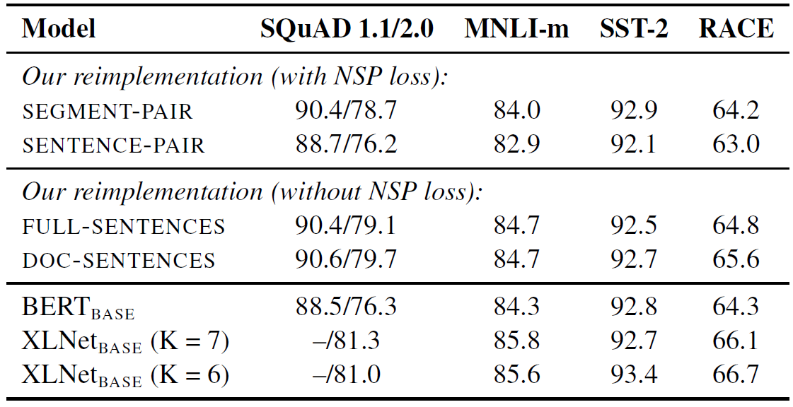
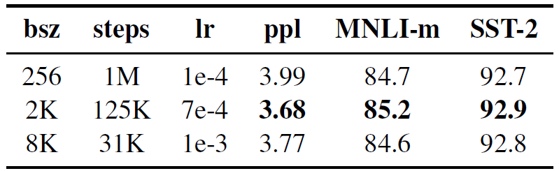

<cite>[[Yinhan Liu]], [[Myle Ott]], [[Naman Goyal]], [[Jingfei Du]], [[Mandar Joshi]], [[Danqi Chen]], [[Omer Levy]], [[Mike Lewis]], [[Luke Zettlemoyer]], [[Veselin Stoyanov]]</cite>
# Introduction

RoBERTa是一种新的 [[BERT-Pre-training-of-Deep-Bidirectional-Transformers-for-Language-Understanding|BERT]] 训练方法，超过了所有的 post-BERT 方法的性能。

本文通过重复 BERT 的研究过程，发现 BERT 是严重欠训练的。本文旨在仔细评估超参数和训练集的大小对模型性能的影响。

RoBERTa 对 BERT 做出的修改如下：

总体上，本文的贡献为：

1. 展示了一系列BERT设计和训练的选择和策略，介绍了可以提高下游任务性能的选择
2. 使用了一个新的数据集：CC-NEWS，确认了使用更多数据进行预训练能够进一步提高下游任务上的表现
3. 实验证明了 MLM 在正确的设计下优于最近新提出的所有方法

# Background

## BERT的介绍
[[BERT-Pre-training-of-Deep-Bidirectional-Transformers-for-Language-Understanding|BERT]]

# Experimental Setup

## 实现BERT

使用原始BERT除了学习率和热身步数的优化超参数实现。在输入序列长度上，使用长度 $T = 512$的设定。不随机插入短序列，仅仅在全长度序列上训练(BERT在前90%的更新上使用缩短的序列)

## 数据

语言模型预训练严重依赖大型数据集，很多工作使用的数据集不能公开，本文收集整理了超过160GB的未压缩文本，其中包括以下的文本语料库：

- $Book Corpus+ English Wikipedia$: 原始BERT预训练使用的数据（16GB）
- $CC-News$: 收集自CommonCraw新闻数据集的英文部分。包含2016年9月到2019年2月之间爬取的6千3百万篇英文新闻文章（过滤后76GB）
- $Open Web Text$: WebText语料库的开源实现，来自Reddit上至少有三个赞的web内容
- $Stories$: CommonCrawl数据集的符合Winograd架构故事的子集

## 评估

在以下benchmarks上评估预训练模型的性能：

- GLUE：我们将模型在GLUE的每个单独的任务数据上进行微调，然后进行评估
- SQuAD：分别在V1.1和V2.0两个版本上进行评估。在V1.1上，使用与BERT一样的范围预测方法，在V2.0上，我们添加了一个额外的二分类层用于预测这个问题是否可回答(答案是否在给定的文本内)，然后将这个二分类层与范围预测的Loss相加来联合训练。在评估时，仅仅对二分类层输出为可以回答的问题进行预测。
- RACE：RACE数据集中对于每个问题的相关文本相比其他数据集更长，且数据集中需要推理的问题占比很大

benchmark的介绍见：

[[Data-Set-and-Benchmark]]

# 训练过程分析

以下的实验和分析旨在探索和量化在预训练BERT的过程中重要的参数选择

## 静态/动态遮罩

原始的 BERT 使用 static masking ，在数据处理时生成静态的mask，然后在训练时使用。为了避免句子在不同的epoch中mask相同，将每个句子复制10次，生成10种不同的mask，然后在40个epoch种使用。
dynamic masking即每个序列在送入模型之前才随机生成mask，这种方法在我们的实验中有轻微优势

## 模型的输入格式和NSP

BERT的实验观察到移除NSP会对模型性能产生影响。但是最近的工作([[XLNet|XLNet]], SpanBERT)质疑NSP的必要性。本文通过下面的实验研究NSP的作用

- $\text{SEGMENT-PAIR+NSP}$: 原始BERT中使用的设定。输入包含两个文本段，每个段可能包含若干个句子，总的token数不超过512。两个文本段等概率地从同一文档或不同文档中采样。
- $\text{SENTENCE-PAIR+NSP}$: 输入中包含两个自然语言句子，两个句子从同一文档中连续采集或从不同文档分别采集的概率相等。因为句子中的token数显著少于512，我们增加了batch size以保证每个batch中的token数与 $\text{SEGMENT-PAIR + NSP}$的相近
- $\text{FULL-SENTENCES}$: 输入从一个或多个文档中连续采集，使得每个输入的token长度都是512。输入可能跨越文档的边界，在文档分界出添加额外的分隔符。移除了NSP Loss
- $\text{DOC-SENTENCES}$: 与 $\text{FULL-SENTENCES}$ 相似，但是输入不再跨文档采集。当采集到文档末尾时，输入中的token数量可能会少于512。这种情况下我们通过动态改变batch size来使token数目达到差不多的水平。移除了NSP Loss

实验结果：

1. 使用句子作为输入会降低模型在下游任务的性能。这可能是因为使用句子而不是文本段使模型无法学习长距离依赖。
2. 移除NSP Loss不影响甚至略有提高在下游任务的性能。这与BERT的实验结果相反，可能是因为BERT的实验中仅仅去除了NSP Loss，但是其输入格式仍然保持 $\text{SEGMENT-PAIR}$ 的格式(两个分段可能从不同文档采集)
3. 让输入序列从同一个文档中采集( $\text{DOC-SENTENCES}$ )相比将不同文档的句子打包在一起 ( $\text{FULL-SENTENCES}$ )有轻微的优势。但是由于 $\text{DOC-SENTENCES}$ 需要动态改变batch size，因此后续的实验中使用 $\text{FULL-SENTENCES}$

## 使用更大的batch训练

原始的 $\text{BERT}_\text{BASE}$ 使用 batch size = 256个序列训练了1M 步，这在计算量上相当于通过梯度累积在 batch size = 2K 个序列训练 125K 步，或者 batch size = 8K 个序列训练 31K 步

后续的实验采用 batch size = 8K 的设置

## 文本编码

原始的BERT使用字符级的BPE，本文使用字节级的BPE。两者在性能上相差无几，但是字节级的BPE更具通用性。

Byte-Pair Encoding, BPE:

# RoBERTa

将以上提到的改进汇总，称之为Robustly optimized BERT approach, RoBERTa。具体地说，包括以下改进：

1. 动态遮罩
2. $\text{FULL-SENTENCES}$ with out NSP
3. 更大的batch size
4. 字节级BPE
5. 预训练数据
6. 训练的次数

对于前四点改进，我们使用与原始BERT的训练数据相当的数据(16GB)训练RoBERTa，验证改进的有效性

然后结合额外的数据(160GB)，相同的训练步数（100K）进行预训练，取得了性能的提高，证明了数据大小和多元化的重要性

最后将训练步数提高到300K和500K进行预训练，观察到显著的提升。说明训练量的重要性。并且观察到最长的训练都没有导致过拟合。

最后将RoBERTa分别在GLUE，SQuAD，RACE上进行评估