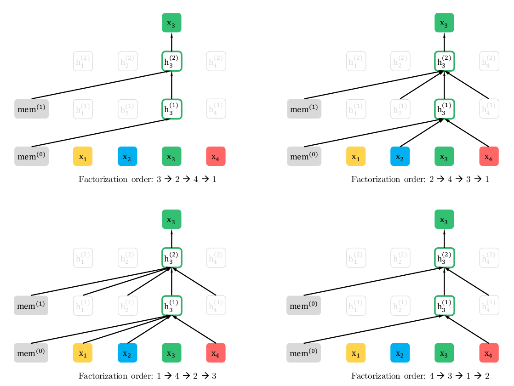
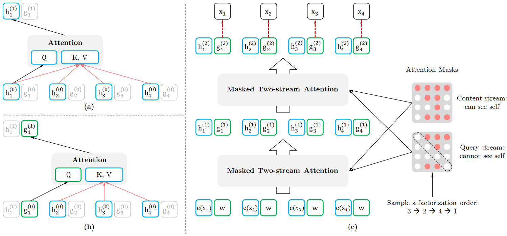

# Xlnet: Generalized autoregressive pretraining for language understanding
<cite>[[Zhilin Yang]], [[Zihang Dai]], [[Yiming Yang]], [[Jaime Carbonell]], [[Ruslan Salakhutdinov]], [[Quoc V.Le]]</cite>

## 标准语言模型(Autoregressive)和 BERT(MLM)

[[BERT-Pre-training-of-Deep-Bidirectional-Transformers-for-Language-Understanding|BERT]] 是一种自编码模型，它使用 MLM 训练目标，试图从被遮罩的语句恢复被遮住的 token。而自回归模型是根据序列中靠前位置的 token 预测下一个 token，对于给定的文本序列 $\mathbf{x} = [x_1, ..., x_T]$, 自回归语言模型的目标是调整参数使得训练数据上的似然函数最大：

$$\max_\theta \log p_\theta(\mathbf{x}) = \sum_{t=1}^T\log p_\theta(x_t|\mathbf{x}_{<t}) = \sum_{t=1}^T\log \frac{\exp(h_\theta(\mathbf{x}_{1:t-1})^Te(x_t))}{\Sigma_{x'}\exp(h_\theta(\mathbf{x}_{1:t-1})^Te(x'))}$$

其中 $\mathbf{x}_{< t}$ 表示 $\mathbf{x}$ 中位置 $t$ 之前的所有 $x$，即 $\mathbf{x}_{1:t-1}$。$h_\theta(\mathbf{x}_{1:t-1})$ 是 RNN 或 [[Attention-is-all-you-need|Transformer]] 编码的隐藏状态。$e(x)$ 是 token $x$ 的 embedding。

而 BERT 是去噪自编码的方法，对于序列 $\mathbf{x}$, BERT 经过随机挑选 token 进行遮罩将其变成带有噪声的 $\hat{\mathbf{x}}$, 假设被遮罩的 token 原始值是 $\overline{\mathbf{x}}$, BERT 根据上下文恢复除被遮罩的 token 的原始值，即：

$$\max_\theta \log p_\theta(\overline{\mathbf{x}}|\hat{\mathbf{x}})\approx\sum_{t = 1}^{T}m_t\log p_\theta(x_t|\hat{\mathbf{x}}) = \sum_{t = 1}^{T}m_t\log \frac{\exp(H_\theta(\mathbf{x})_t^Te(x_t))}{\Sigma_{x'}\exp(H_\theta(\mathbf{x})_t^Te(x'))}$$

式中 $m_t = 1$ 表示位置 $t$ 是一个 MASK，需要被恢复。$H_\theta$ 是一个 Transformer，它将长度为 $T$ 的序列 $\mathbf{x}$ 映射为隐藏状态序列 $H_\theta(\mathbf{x}) = [H_\theta(\mathbf{x})_1, ..., H_\theta(\mathbf{x})_T]$。（这里的 BERT 可以注意到整个序列所有的 token，因此记作 $H_\theta(\mathbf{x})$, 前面的自回归模型只能注意到位置 $t$ 之前的 token，因此记作 $h_\theta(\mathbf{x}_{1:t-1})$）

对于 BERT，其缺陷有：
1. 独立假设
    注意到 BERT 的训练目标表达式中使用了 $\approx$, 意为在给定的遮罩信息 $\hat{\mathbf{x}}$ 的条件下，被遮罩的 token 之间是独立的，这个假设显然不成立。例如语句 $\text{New York is a city}$ ，假设被遮住的是 $\text{New}$ 和 $\text{York}$，那么在给定 $\text{is a city}$ 的条件下两个被遮住的 token 并不独立。
2. 预训练与微调的割裂
   BERT 在预训练时会有特殊的 token MASK，这种 token 在下游的微调过程中不会出现

对于标准语言模型，其缺陷有：
1. 双向上下文
    标准语言模型只能利用一个方向的上下文

## 排列语言模型(Permutation Language Model)

XLNet 使用排列语言模型实现了结合上下文信息并且不引入 [MASK] 标记，同时类似自回归的预测过程避开了独立假设的限制。

### 语序分解

对于给定长度 $T$ 的序列 $\mathbf{x}$，总共有 $T!$ 种排列顺序，也就是说在自回归时有 $T!$ 种链式分解方法。假设 $\mathbf{x} = [x_1, x_2, x_3]$, 则总共有 $3! = 6$ 种分解方式：

$$\begin{array}{c}
    p(\mathbf{x}) = p(x_1)p(x_2|x_1)p(x_3|x_1x_2)\Rightarrow 1\rightarrow 2\rightarrow 3\\
    p(\mathbf{x}) = p(x_1)p(x_2|x_1x_3)p(x_3|x_1)\Rightarrow 1\rightarrow 3\rightarrow 2\\
    p(\mathbf{x}) = p(x_1|x_2)p(x_2)p(x_3|x_1x_2)\Rightarrow 2\rightarrow 1\rightarrow 3\\
    p(\mathbf{x}) = p(x_1|x_2x_3)p(x_2)p(x_3|x_2)\Rightarrow 2\rightarrow 3\rightarrow 1\\
    p(\mathbf{x}) = p(x_1|x_3)p(x_2|x_1x_3)p(x_3)\Rightarrow 3\rightarrow 1\rightarrow 2\\
    p(\mathbf{x}) = p(x_1|x_2x_3)p(x_2|x_3)p(x_3)\Rightarrow 3\rightarrow 2\rightarrow 1
\end{array}$$

值得注意的是，排序语言模型中的语序并没有改变，只是预测的顺序发生了改变。例如 $p(x_2|x_1x_3)$ 指的是第一个 token 是 $x_1$，第三个 token 是 $x_3$ 的情况下第二个词是 $x_2$ 的概率，而不是第一个 token 是 $x_1$，第二个 token 是 $x_3$ 的情况下第三个 token 是 $x_2$ 的概率。

对于这 $T!$ 种排序方法，如果模型可以遍历所有的情况，并且参数是共享的，则这个模型就能学习到各种的上下文。但是这种策略的计算开销非常大，实际上只能随机采样部分排列方式。用数学语言描述排列语言模型的目标为：

$$\max_\theta \mathbb{E}_{z\sim\mathcal{Z}_T}[\sum_{t = 1}^{T}\log p_\theta(x_{z_t|\mathbf{x}_{z_{<t}}})]$$

即调整参数使得似然概率最大。其中 $\mathcal{Z}_T$ 表示长度为 $T$ 的序列中所有的**排列方式**的集合，$z\in \mathcal{Z}_T$ 表示其中的一种排列方法。$z_t$ 表示第 $t$ 种排列，$z_{<t}$ 表示 $z$ 的第 $1\sim t - 1$ 个元素。

在实际的实现中，XLNet 是通过 Attention 的 Mask 来实现不同的排序方式。例如 $p(x_1|x_3)p(x_2|x_1x_3)p(x_3)$ ,可以在 Transformer 编码 $x_1$ 的时候 attend to $x_3$, 同时把 $x_2$ Mask 掉，就实现了 $p(x_1|x_3)$。

## 双流注意力机制(Two-Stream Self-Attention for Target-Aware Repersentations)

### 位置信息问题

上述的排序语言模型存在位置信息缺失的问题。例如输入的句子是 $\text{I like New York}$, 并且采样到的一种排序为 $z = [1, 3, 4, 2]$, 在预测 $z_3 = 4$ 位置时，根据公式：

$$p_\theta(X_{z_3} = x|x_{z_1z_2}) = p_\theta(X_4 = x|x_1x_3) = \frac{\exp(e(x)^Th_\theta(x_1x_3))}{\Sigma_{x'}\exp(e(x')^Th_\theta(x_1x_3))}$$

上式用自然语言描述为，第一个词是 $\text{I}$, 第三个词是 $\text{New}$ 的条件下第四个词是 $\text{York}$ 的概率。

另外再看另一种排列 $z' = [1, 3, 2, 4]$, 在预测 $z_3 = 2$ 时：

$$p_\theta(X_{z_3} = x|x_{z_1z_2}) = p_\theta(X_2 = x|x_1x_3) = \frac{\exp(e(x)^Th_\theta(x_1x_3))}{\Sigma_{x'}\exp(e(x')^Th_\theta(x_1x_3))}$$

表示第一个词是 $\text{I}$，第三个词是 $\text{New}$ 的条件下第二个词是 $\text{York}$ 的概率。对比发现上面两个概率是相同的，这不符合日常经验。问题的关键就在于模型无法获知要预测的词在原始语句中的位置。

### 双流注意力

在 Transformer 中，token 的位置信息使用 positional embedding 编码并加到 embedding 中，然后随 token 输入到模型中。这使得模型只能获取注意到的 token 的位置信息，不能获取要预测的 token 的位置信息。例如 $p(X_4 = x|x_1x_3)$ 中模型 attend to $x_1, x_3$, 则模型在获得 $x_1, x_3$ 的 embedding 的同时可以获得其位置信息，但是对于要预测的 token $X_4$, 则不可能获取其 embedding，也就无法获取位置信息。

因此必须显示地告诉模型要预测的词处于序列中的位置。对于给定的排列 $z$，要计算 $p_\theta(X_{z_t} = x|\mathbf{x}_{z_{<t}})$ 时，朴素的 Transformer 计算过程如下：

$$p_\theta(X_{z_t} = x|\mathbf{x}_{z_{<t}}) = \frac{\exp(e(x)^Th_\theta(\mathbf{x}_{z_{<t}}))}{\Sigma_{x'}\exp(e(x')^Th_\theta(\mathbf{x}_{z_{<t}}))}$$

这样对于相同的上下文和相同的词，其处在不同位置的概率是相同的。为解决这一问题，XLNet 将要预测的位置 $z_t$ 放在模型中：

$$p_\theta(X_{z_t} = x|\mathbf{x}_{z_{<t}}) = \frac{\exp(e(x)^Tg_\theta(\mathbf{x}_{z_{<t}}, z_t))}{\Sigma_{x'}\exp(e(x')^Tg_\theta(\mathbf{x}_{z_{<t}}, z_t))}$$

要找到一个模型来实现 $g_\theta(\mathbf{x}_{z_{<t}}, z_t)$ 的功能，那么这个函数需要满足两点要求：
1. 为了预测 $x_{z_t}$, $g_\theta(\mathbf{x}_{z_{<t}}, z_t)$ 只能使用位置信息 $z_t$ 而不能使用 $x_{z_t}$(否则模型直接看到了要预测的词)
2. 为了预测 $z_t$ 之后的词，$g_\theta(\mathbf{x}_{z_{<t}}, z_t)$ 必须编码 $x_{z_t}$ 的语义信息

这两点对于朴素的 Transformer 来说是矛盾的，例如在第一层 Attention 编码 $x_{z_1}$ 时，如果利用了 $x_{z_1}$ 的信息，那么可以获得其位置信息，但同时它本身的语义信息也泄露了。如果不利用 $x_{z_1}$ 的语义信息，只利用其位置信息，那么在下一层的 Attention 编码 $x_{z_2}$ 时，编码的依赖条件之一 $h_1^0(x_{z_1})$ 中没有语义信息，相当于凭空对 $x_{z_2}$ 编码。

因此需要引入双流注意力，即两个隐藏状态：
1. 内容隐藏状态 $h_\theta(\mathbf{x}_{z_{<t}})$, 简写为 $h_{z_t}$, 和标准的 Transformer 中的隐藏状态一样，即编码上下文也编码 $x_{z_t}$ 本身的内容
2. 查询隐藏状态 $g_\theta(\mathbf{x}_{z_{<t}}, z_t)$, 简写为 $g_{z_t}$, 它只编码上下文和要预测的位置 $z_t$，不包含 $x_{z_t}$ 的语义信息

在实际计算时，第0层的两种隐藏状态 $g_i^0, h_i^0$ 分别被初始化为随机变量 $w$ 和词的 embedding $e(x_i)$。接着向高层传递时，按照下面的过程逐层传递：

$$\begin{array}{c}
    g_{z_t}^m\leftarrow Attention(Q = g_{z_t}^{m-1}, KV = h_{z_{<t}}^{m-1}; \theta)\\
    h_{z_t}^m\leftarrow Attention(Q = h_{z_t}^{m-1}, KV = h_{z_{\leq t}}^{m-1}; \theta)
\end{array}$$

上述两个流分别是 Query 流和 Content 流。其中 Query 流中的 $Q$ 来自上一层的 $g_{z_t}$, Content 流的 $Q$ 来自上一层的 $h_{z_t}$, 而两个流的 $K, V$ 都来自上一层的 $h$, 其中 Query 流的 $K, V$ 来自 $h_{z_{<t}}$, 代表其不能访问当前 token 的信息，Content 流的 $K, V$ 来自 $h_{z_{\leq t}}$, 包含当前 token 的语义信息。

如图是双流注意力模型的示意图。

(a) 图所示是 Content 流的计算过程，假设排列为 $3\rightarrow 2\rightarrow 4\rightarrow 1$, 并且当前正在编码的是第一个词。Content 流可以参考所有 token 的信息，因此 $KV = [h_1^0, h_2^0, h_3^0, h_4^0]$, 而 $Q = h_1^0$。

(b) 图所示是 Query 流的计算过程，因为 Query 流不能参考自己的内容，因此 $KV = [h_2^0, h_3^0, h_4^0]$, 而 $Q = g_1^0$

(c) 图是完整的计算过程，按照从下而上的顺序，首先 $h^0, g^0$ 分别被初始化为词嵌入 $e(x_i)$ 和随机变量 $w$，然后 Content Mask 和 Query Mask 计算第一层的输出 $h^1, g^1$, 逐层传递。图中的 Attention Mask 中，**纵坐标从上到下表示当前预测的 token 编号，横坐标从左到右表示可以 Attend to 的 token 编号**，其中红点表示可以 Attend to, 白点表示不能 Attend to。因此， Content Mask 第一行表示：预测第一个 token 时可以 Attend to 所有的 token，第三行表示预测第三个 token 时只能 Attend to 自己。Query Mask 的对角线全白表示 Query Stream 不能 Attend to 自身。

## 部分预测

排列语言模型可以利用每种排列中的每一个 token，由于计算量的原因，只在所有排列中随机抽取部分排列，同时由于对所有的 token 进行预测模型难以收敛，XLNet 只选择排列的最后 $\frac{1}{K}$ token 进行预测。

可以将一个排列 $z$ 分成两个子序列 $z_{\leq c}$ 和 $z_{>c}$, 分别叫做 non-target 序列和 target 序列，$c$ 是分割点。因此有：$\frac{|z| - c}{|z|} = \frac{1}{K}$

## 结合 Transformer-XL 的思想

1. 相对位置编码
2. cache 隐状态
   假设有两个从原始序列 $\mathbf{s}$ 中抽取的 segment，$\widetilde{x} = s_{1:T}$ 和 $x = s_{T+1:2T}$。同时假设 $\widetilde{z}, z$ 分别是 $[1, ..., T], [T+1, ..., 2T]$ 的一个排列。然后根据排列 $\widetilde{z}$ 的链式分解计算第一个 segment，并且把 Content 流的隐状态 $\widetilde{h}$ 缓存下来，那么第二个 segment 的 Content 流计算方法如下

   $$h_{z_t}^m \leftarrow Attention(Q = h_{z_t}^{m-1}, KV = [\widetilde{h}^{m-1}, h_{z\leq t}^{m-1}]; \theta)$$

   用自然语言描述为：计算 $z_t$ 第 $m$ 层的隐藏状态时，Query 是上一层的隐藏状态 $h_{z_t}^{m - 1}$, 而 Key 和 Value 除了 $z_1, ..., z_t$ 第 $m-1$ 层的隐状态，还要 Attend to 缓存的上一个 segment 的所有位置的隐藏状态。

## 与 BERT 对比

BERT 使用 MLM，因此只能预测部分词。XLNet 理论上可以预测所有词，但出于性能考虑只预测部分词。除此之外，BERT 由于独立性假设的原因，信息的利用率弱于 XLNet。

例如假设输入是 $\text{[New, York, is, a, city]}$, 并且 XLNet 和 BERT 都选中了使用 $\text{[is, a, city]}$ 来预测 $\text{New}$ 和 $\text{York}$。同时假设 XLNet 使用的排列顺序是 $\text{is, a, city, New, York}$。那么两个模型要优化的目标函数分别为：

$$
\begin{array}{c}
    \mathcal{J}_\text{BERT} = \log p(\text{New|is a city}) + \log p(\text{York|is a city})\\
    \mathcal{J}_\text{XLNet} = \log p(\text{New|is a city}) + \log p(\text{York|\color{red}{New} \color{normal}{is a city}})
\end{array}
$$

## 参考

1. http://papers.nips.cc/paper/8812-xlnet-generalizedautoregressive-pretraining-for-language-understanding.pdf
2. http://fancyerii.github.io/2019/06/30/xlnet-theory/
3. https://zhuanlan.zhihu.com/p/70257427